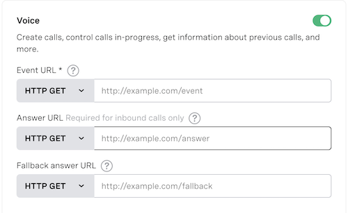

# Ruby Vonage WebSockets Voice API Demo App

[](CODE_OF_CONDUCT.md)
[](./LICENSE.txt)


This is a demo app showcasing how to build a Ruby app that utilizes [Vonage Voice API WebSockets](https://developer.nexmo.com/voice/voice-api/guides/websockets).

Users call the application and the audio from the call is streamed to the application via a Vonage Video API WebSocket connection. At the conclusion of the call, the user can play the audio from the website.

* [Requirements](#requirements)
* [Installation](#installation)
* [Usage](#usage)
* [License](#license)

## Requirements

This app requires Ruby v2.7 or greater and the following gems:

* [WaveFile](https://github.com/jstrait/wavefile)
* [Faye-WebSocket](https://github.com/faye/faye-websocket-ruby)
* [JSON](https://github.com/flori/json)
* [Rack](https://github.com/rack/rack)
* [Puma](https://github.com/puma/puma)

These are all included in the project's `Gemfile` and will be installed when you run `bundle install` from the command line.

## Installation

Once you clone the repository, make sure its dependencies are installed on your local machine:

```bash
$ bundle install
```

## Usage

This application requires a Vonage provisioned virtual number that is linked to a Voice Voice application. Both of those items can be created from your [Vonage Dashboard](https://dashboard.nexmo.com). The phone number you create in the Dashboard will be the number that you will call to use your application.

You will need to provide an `answer URL` for the application you create that corresponds to the answer route provided in the `app.rb` file. The answer URL needs to be an externally accessible URL that ends with `/webhooks/answer`. For example, if your URL was `example.com`, then your answer URL would be `http://example.com/webhooks/answer`.



Next, open up the `app.rb` file in your preferred code editor and add an externally accessible URL for Vonage WebSockets to send data to. 

Once, you have done so, you can run the application by executing the following command:

```bash
$ bundle exec rackup app.rb
```

To run in *`production`* mode:

```bash
$ bundle exec rackup -s puma app.rb -E production
```

The above command will begin a web server running on port 9292.

The application is now ready to call. Once you hang up the call, you can visit `localhost:9292` in your browser and play the audio that was recorded via the WebSocket connection.

## License

This library is released under the [MIT License][license]

[license]: LICENSE.txt
